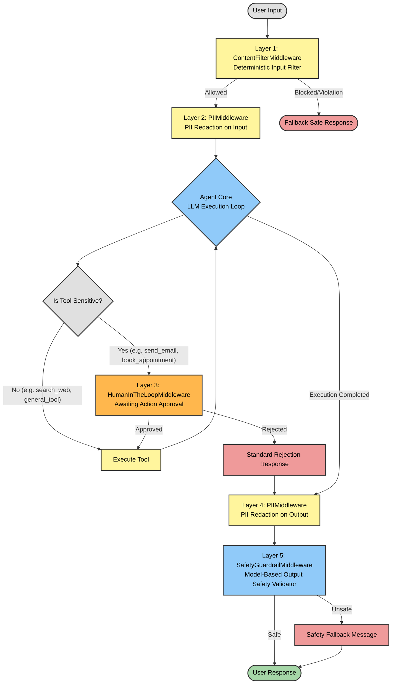

# 🛡️ Guardrails with LangChain — Agent Middleware system

This project provides a comprehensive hands-on guide and course on implementing robust **Guardrails** in LangChain agents using the advanced middleware system. By intercepting communication at key interception points—before agent execution, around tool execution, model call cycles, and post-agent execution—agents can be made safe, predictable, compliant, and cost-effective.

---

## 🗺️ Middleware Guardrail Cycle Architecture

The following diagram represents the core workflow of layered guardrail middlewares demonstrating how incoming human requests are parsed, redacted, verified, executed, and validated with fallback responses and human checkpointers.



*(See also the standalone [architecture.mermaid](architecture.mermaid) diagram file included in this repository.)*

---

## 📁 Project Structure

The project has the following modular layout optimized for GitHub:

- [langchain_guardrails.ipynb](langchain_guardrails.ipynb): The primary Jupyter Notebook covering all 8 core course topics, code exercises, and healthcare virtual chatbot agent.
- [requirements.txt](requirements.txt): Environment configuration file detailing required pip packages and framework versions.
- [architecture.mermaid](architecture.mermaid): Standardized standalone diagram representing the complete layered middleware workflow.
- [.gitignore](.gitignore): Git directory exclusion instructions to ensure checkpoints, keys, and virtual environments are never uploaded.

---

## 🛠️ Environment Setup & Installation

### 1. Prerequisites
- Python 3.10 to Python 3.12 is recommended for optimal compatibility.
- Ensure you have `pip` and a virtual environment package manager installed.

### 2. Set Up Virtual Environment
Create and activate an isolated Python environment for clean installations:

**On macOS / Linux:**
```bash
python3 -m venv .venv
source .venv/bin/activate
```

**On Windows:**
```powershell
python -m venv .venv
.venv\Scripts\activate
```

### 3. Install Dependencies
Once the virtual environment is active, install the required packages and dependencies specified in [requirements.txt](requirements.txt):

```bash
pip install -r requirements.txt
```

---

## 🔑 Configuration & API Keys

The notebooks of this course construct OpenAI client connections and use model intelligence. You need to configure your OpenAI API Key.

1. Create a file named `.env` in the root folder of this project:
   ```env
   OPENAI_API_KEY=your-actual-api-key-here
   ```
2. The notebook will automatically locate and load this variable using the `dotenv` python module inside the first notebook cells.

---

## 🚀 How to Run the Jupyter Notebook

1. Ensure your virtual environment is active.
2. Launch Jupyter Notebook or VS Code Jupyter:
   ```bash
   jupyter notebook
   ```
   *Alternatively, if using VS Code, simply select the [langchain_guardrails.ipynb](langchain_guardrails.ipynb) file, set the Kernel connection pointer to `.venv`, and run the cells.*
3. Open and run the cells on [langchain_guardrails.ipynb](langchain_guardrails.ipynb) in chronological order.
